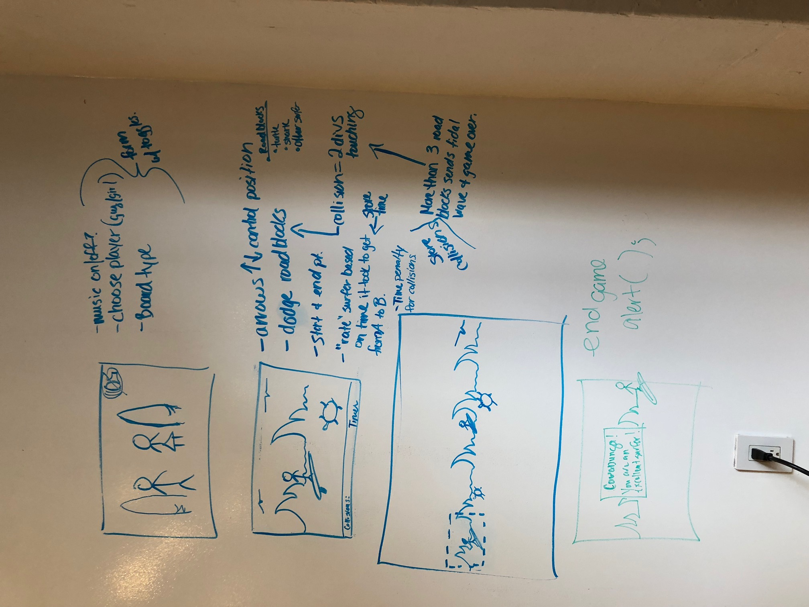

# Project Overview

## Project Schedule

This schedule will be used to keep track of your progress throughout the week and align with our expectations.  

|  Day | Deliverable | 
|---|---| 
|Day 1: Tue| Wireframes and Priority Matrix|
|Day 2: Wed| Project Approval /  Pseudocode / actual code|
|Day 3: Thur| Basic Clickable Model |
|Day 4: Fri| Working Prototype |
|Day 5: Sat| Final Working Project |
|Day 6: Sun| Bugs / Stylying / PostMVP |
|Day 7: Mon| Project Presentations |


## Project Description

    My game is a timed, surfer-themed game where an object (the surfer) tries to avoid hitting other objects (turtles.) I'm going to use the 2D-collision detection function to record when the two objects collide, and the player then gets a time penalty.  When the game ends the player is rated on a scale based on their time. 

## Wireframes
  

## Priority Matrix

Include a full list of features that have been prioritized based on the `Time and Importance` Matix.  

-obtain necessary imagery for files  
-animate the background image and create surfer div  
-assign event listeners for keyup/keydown so that keyboard arrows can move surfer on the Y-axis  
-create turtle divs and test for 2D-collision  
-visually alert the user that there has been a collision  
-assign positioning to turtles  
-turn on/off display of positioned turtles  
-use Math.random to give "turtles" random positioning (but limited so they don't fly in the sky)  
-store collision events and equate to time penalty  
-add end game function  
-add timing function (also show timing)  
-add landing page choose player option  
-add audio and option to turn off  
-make surfer "shimmy"  
-if X amt of collisions occur, animate wave across page and pop up "GAME OVER"  

## Game Components

### Landing Page
What will a player see when they start your game?  
    -Welcome page that asks you to choose guy/girl surfer  
    -option to listen to music  
    -instructions on how to use up/down arrows to move surfer  

### Game Initialization
What will a player see when the game is started?  
    -A surfer on a surf board and the background with a delayed start to moving on the X-axis.  

### Playing The Game
What will be the flow of the game, what will the user be expected to do and what will the user expect from the game.  
      
    -User is expected to use up and down arrows to move surfer up and down the screen to avoid collision objects (turtles).  If there is a collision there will be a visual cue that alerts the user but the game will continue on.  

### Winning The Game
What does it look like when the game ends, what determines winning or losing? 

    -The game runs an allotted amt of time so when that time is up the game is up.  Any collisions add time to the total time.  The user's time total is measured against a scale which determines which of 3 messages appear to the user at the end of the game.  


### Game Reset
How will the user restart the game once it has been completed. 

    -Reset button following end of game prompt  

## MVP 
Include the full list of features that will be part of your MVP  
-landing page with choices  
-game page  
-moving divs  
-detect and log collisions  
-timer  
-end game  
-reset game  

## POST MVP  
-surfer shimmy  
-multiple types of "road blocks"  
-game over wave  


Include the full list of features that you are considering for POST MVP
## Functional Components  
Based on the initial logic defined in the previous game phases section try and breakdown the logic further into functional components, and by that we mean functions.  Does your logic indicate that code could be encapsulated for the purpose of reusablility.  Once a function has been defined it can then be incorporated into a class as a method. 
  
  -setInterval(); for collision detection and making and moving turtles  
  -addEventListerners() or 'on' functions for keydown on arrows;
  -math.random(); for assigning coordinates to turtles

Time frames are also key in the development cycle.  You have limited time to code all phases of the game.  Your estimates can then be used to evalute game possibilities based on time needed and the actual time you have before game must be submitted. 

| Component | Priority | Estimated Time | Time Invested | Actual Time |
| --- | :---: |  :---: | :---: | :---: |
| Landing Page HTML/CSS| H | 4hrs| 3hrs | 3hrs |
| Gaming Page HTML/CSS | H | 4hrs| 3hrs | 3hrs |
| Logic for moving background  | H | 2hrs| 4hrs | 4hrs |
| Logic for collision and visual indicator| H | 10hrs| 8hrs | 8hrs |
| Logic for turtle display and location| H | 8hrs| 8hrs | 8hrs |
| Logic for timing | H | 5hrs| 5hrs | 5hrs |
| Logic for Game Over | H | 5hrs| 2hrs | 2hrs |
| Logic for restart | H | 2hrs| 2hrs | 2hrs |
| add landing page options | H | 6hrs| 0hrs | 0hrs |
| Bonus - surfer shimmy | H | 2hrs| 0hrs | 0hrs |
| Bonus - game over wave & logic | H | 6hrs| 0hrs | 0hrs |
| Total |  | 48hrs| 70hrs | 70hrs |

## Helper Functions
Helper functions should be generic enought that they can be reused in other applications. Use this section to document all helper functions that fall into this category.

| Function | Description | 
| keydown | lets the arrows move a div |  
| startTime | starts a timer that works on a interval and adds 1 sec to time, every 1 sec  | 

## Additional Libraries
 Use this section to list all supporting libraries and their role in the project. 

## Code Snippet

Use this section to include a brief code snippet of functionality that you are proud of an a brief description. 
```//**********COLLISION DETECTION*******************
  window.setInterval(detectCollision, 330);

  function detectCollision() {
    let surferWidth, surferHeight, surferX, surferY,
        turtleWidth, turtleHeight, turtleX, turtleY;
    let turtle = $('.background-image div:last-child');

    surferWidth = surfer.outerWidth();  //Width, Height, X & Y check of surfer's position
    surferHeight = surfer.outerHeight();
    surferX = surfer.offset().left;
    surferY = surfer.offset().top;
    turtleWidth = turtle.outerWidth(); //Width, Height, X & Y check of turtle's position
    turtleHeight = turtle.outerHeight();
    turtleX = turtle.offset().left;
    turtleY = turtle.offset().top;

    if ((surferX + surferWidth) > (turtleX) && surferX < (turtleX + turtleWidth) &&
        (surferY + surferHeight) > (turtleY) && surferY <(turtleY + turtleHeight)) {
      turtle.css('display', 'none');
      timePenaltyArray.push('hit'); //push to an array and access sum of array for Total Count
      }
    }
```

```     //***********MAKE AND LAUNCH TURTLES****************
  const turtleGenerator = setInterval(makeAndMoveTurtles, 3000); // if less that 3 sec intervals then
                                                                // collision detection stops working
    function randomTurtles() {
      let y = Math.floor(Math.random() * (window.innerHeight - 200)); //adds random start location of turtles
                                                                      //within height of window
      turtlePositionArray.push(y);
    }

    function makeAndMoveTurtles() {
    randomTurtles();
    for (let i = 0; i < turtlePositionArray.length; i++) {
      let newTurtles = $('.background-image').append('<div class="turtle"></div>');
      $('.background-image div:last-child').css("top", turtlePositionArray[i]);
      $('.background-image div:last-child').css("right", -200); //starts turtle off screen
      $('.background-image div:last-child').css("display", "block");
      $('.background-image div:last-child').css("animation-name", "turtlemove");

      turtlePositionArray = [];
    }
  }
    function stopTurtles() {
      clearInterval(turtleGenerator);    //function to stop making turtles later
  }  
  ```  
  
## jQuery Discoveries
 Use this section to list some, but not all, of the jQuery methods and\or functionality discovered while working on this project.
 .offset()
 .outerHeight()  
 .outerWidth()    
 .css()  
 .html()  

## Change Log
 Use this section to document what changes were made and the reasoning behind those changes.    
- I moved the timer/reset to the top of the screen bc that was easier to style.
## Issues and Resolutions
 Use this section to list of all major issues encountered and their resolution.

 I had issues with all my game setInterval functions also starting on the landing page so I moved the Jquery document.ready() to each page and called one massive function that held all the functions needed for that page.   

#### SAMPLE.....
**ERROR**: app.js:34 Uncaught SyntaxError: Unexpected identifier                                
**RESOLUTION**: Missing comma after first object in sources {} object  
  
  Also, I'm including a link to my google slide presentation bc I missed watching Homeland to do it so hopefully someone will look at it.
https://docs.google.com/presentation/d/1TFQxLMdqc03b0C9a9_aioWYoTJwJouSziM8YdiOtfxE/edit?usp=sharing
